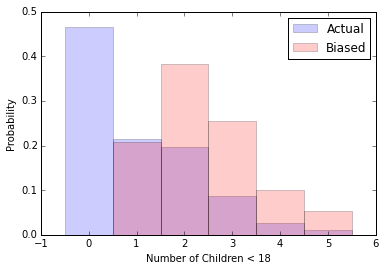

```python
%matplotlib inline

import matplotlib
import matplotlib.pyplot as plt
import chap01soln

resp = chap01soln.ReadFemResp()
```

For exercise 3-1 we first need to construct a probability mass function from the data for number of children in a household.<br>
In order to construct this PMF we need:
- frequency of each response
- total number of responses
Dividing the number of responses for a value, over the total responses gives the PMF.<br>

The PMF demonstrates the probability for a household to have a given number of children.


```python
freq = dict(resp['numkdhh'].value_counts())
total_responses = len(resp['numkdhh'])

my_pmf = {}
for num_children, n in freq.iteritems():
    my_pmf[num_children] = float(n)/total_responses

print 'Dictionary with values for the probability mass function:', my_pmf
```

    Dictionary with values for the probability mass function: {0: 0.46617820227659296, 1: 0.21405207379301322, 2: 0.19625801386889966, 3: 0.08713855815779144, 4: 0.025644380478869553, 5: 0.01072877142483318}


The values in the PMF should have a sum of 1.


```python
sum(my_pmf.values())
```


    1.0


Next we need to calculate the biased distribution.  <br>

To do this we multiply each probability in the original PMF by the size of the family that it represents.  Then we normalize the values to have a sum of 1.<br>

This distribution represents the perspective of sampling by asking the children how many children are in their family.  The bias is a result of multiplying the number of times a single sample is observed in the data set.


```python
my_biased = {}

for num_children, n in my_pmf.items():
    my_biased[num_children]=num_children*n

    
temp_total = sum(my_biased.values())

for num_children, n in my_biased.iteritems():
    my_biased[num_children]=n/temp_total
    
print 'Dictionary of biased PMF:', my_biased

print sum(my_biased.values())
```

    Dictionary of biased PMF: {0: 0.0, 1: 0.20899335717935616, 2: 0.38323965252938175, 3: 0.25523760858456823, 4: 0.10015329586101175, 5: 0.052376085845682166}
    1.0


```python
fig, ax = plt.subplots()
ax.bar(range(len(my_pmf)), my_pmf.values(),align='center',width=1.0,alpha=.2,label='Actual')
ax.bar(range(len(my_biased)), my_biased.values(),align='center',width=1.0,alpha=.2,color='red',label='Biased')
ax.legend()
ax.set_ylabel('Probability')
ax.set_xlabel('Number of Children < 18')
```


    <matplotlib.text.Text at 0x7f50a1dd8390>





Finally we need to compute the means for both the actual and biased PMFs.  The mean for the PMFs is the expected value of children under 18 for a random family.  The calculation is probability times the number of children under 18.


```python
def pmf_mean(values):
    sum = 0.
    for num_children, probability in values.iteritems():
        sum += num_children * probability
    return sum    

my_pmf_mean = pmf_mean(my_pmf)
my_biased_mean = pmf_mean(my_biased)

print 'Actual PMF mean:', my_pmf_mean
print 'Biased PMF mean:', my_biased_mean
```

    Actual PMF mean: 1.02420515504
    Biased PMF mean: 2.40367910066


If only the head of the household is sampled, the expected value for a response of the number of children in a family would be 1.024.<br>

If children are sampled, the expected value for a response would be 2.4036.<br>

This makes intuitive sense because families with no children would have no children sampled.  Thus by removing those 0 values, and increasing the number of times a child from a larger family is sampled, the expected value increases significantly.


```python

```
