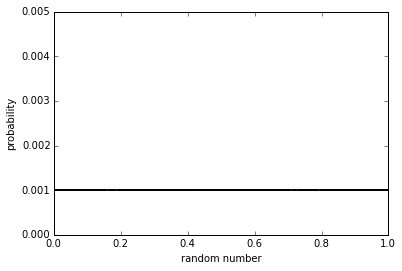
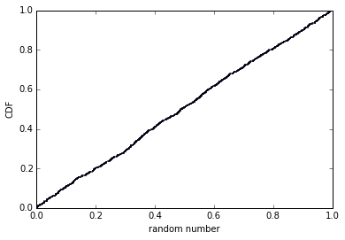

```python
%matplotlib inline

import matplotlib.pyplot as plt
import random
```

The question asks, is the distribution of 1000 numbers from random.random uniform?<br>

In order to answer this we first generate 1000 random numbers from random.random() as our sample.


```python
r = [random.random() for x in range(0,1000)]
```

Next we generate a pmf using the sample and plot that pmf.  The pmf is generated by taking the number of occurances of a value and dividing it by the total sample size, 1000.


```python
def pmf(lst):    
    my_pmf = {}
    for i in lst:
        my_pmf[i] = float(lst.count(i))/len(lst)
    return my_pmf

my_pmf = pmf(r)

plt.scatter(my_pmf.keys(), my_pmf.values(),s=1)
plt.axis([0,1,0,.005])
plt.ylabel('probability')
plt.xlabel('random number')
```


    <matplotlib.text.Text at 0x7f52666b64d0>





This pmf is more or less a flat horizontal line implying the distribution is uniform.  <br>

This plot occurs because all values in the pmf have a probability of .001.  Stated otherwise, each value has a 1/1000 chance of occuring or there is only one of each value in our sample set of size 1000.


```python
def cdf(pmf):
    my_cdf = {}
    previous = 0
    for key in sorted(pmf):
        my_cdf[key] = pmf[key] + previous
        previous = my_cdf[key]
    return my_cdf

my_cdf = cdf(my_pmf)

plt.scatter(my_cdf.keys(), my_cdf.values(),s=.5)
plt.axis([0,1,0,1])
plt.ylabel('CDF')
plt.xlabel('random number')
```


    <matplotlib.text.Text at 0x7f526669e450>





The plot of the CDF is roughly a straight line of constant slope.<br>

This means that the distribution is uniform.
