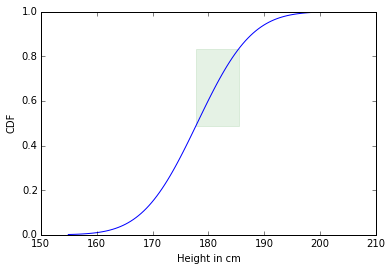

```python
%matplotlib inline
import scipy.stats
import numpy as np
import matplotlib.pyplot as plt
from matplotlib.patches import Rectangle
```

The question asks, what percentage of the male population is in the range between 5'10" and 6'1"?<br>

Using the normal distribution with mean 178cm and standard deviation 7.7cm, we can find this percentage.
First we need to generate a normal distribution with those parameters.


```python
mean = 178
stddev = 7.7
my_norm = scipy.stats.norm(loc=mean,scale=stddev)
```

Next we convert the inches of the range to centimeters using the conversion `1 in = 2.54 cm`.


```python
def inchcm(ft,inch):
    inch = ft*12+inch
    return inch*2.54

lowheight = inchcm(5,10)
highheight = inchcm(6,1)

print lowheight,highheight
```

    177.8 185.42


The `cdf(x)` function calculates the percentage of people from 0 to the value `x`.  So in order to find the percentage of the population between `lowheight` and `highheight` we find the cdf of both and subtract the lower from the higher.


```python
print my_norm.cdf(highheight)
print my_norm.cdf(lowheight)
print 'The percentage of the population between 5\'10" and 6\'1" is:', (my_norm.cdf(highheight) - my_norm.cdf(lowheight))*100
```

    0.832385865496
    0.489639027865
    The percentage of the population between 5'10" and 6'1" is: 34.2746837631


We can visualize the portion of the population that we are examining.<br>

The heights are represented on the x-axis between 177.8cm and 185.42cm.  The 34.27% population contained, represented on the y-axis from 48% to 83%.


```python
x = np.linspace(mean-3*stddev,mean+3*stddev,100)
plt.plot(x,scipy.stats.norm.cdf(x,loc=178,scale=7.7))
plt.ylabel('CDF')
plt.xlabel('Height in cm')
plt.gca().add_patch(Rectangle((lowheight,my_norm.cdf(lowheight)), highheight-lowheight,my_norm.cdf(highheight) - my_norm.cdf(lowheight),color='g',alpha=.1))
```


    <matplotlib.patches.Rectangle at 0x7f681d9f6e50>




To answer the original question, 34.27% of the US male population is between 5'10" and 6'1".
