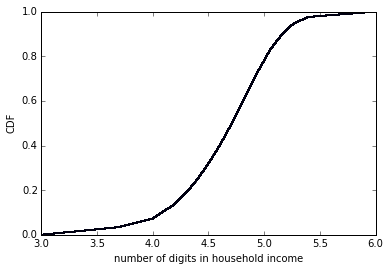
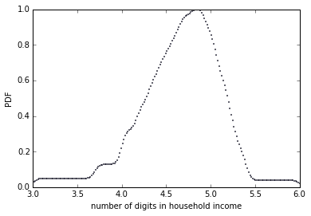
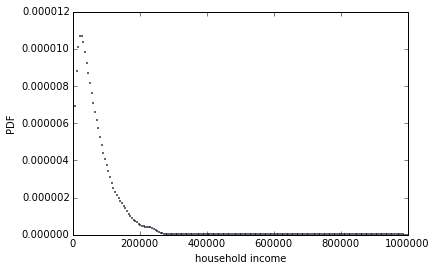

```python
%matplotlib inline

import hinc
import numpy as np
import matplotlib.pyplot as plt
import scipy

#Got a bunch of warnings in the output, so I've ignored them all.
import warnings
warnings.filterwarnings('ignore')
```

First we read the data, and then interpolate the data as the exercise describes. <br>
The method for this interpolation is to take the upper and lower bound based on a log scale of income and create even "samples" based on the number of incomes originally in that range.


```python
df = hinc.ReadData()
```


```python
def interpolate(df, log_upper = 6.0):
    df['log_upper'] = np.log10(df.income)

    df['log_lower'] = df['log_upper'].shift(1)
    df['log_lower'][0] = 3.0

    df.log_upper[len(df)-1] = log_upper

    arrays  = []
    for x, row in df.iterrows():
        vals = np.linspace(row['log_lower'], row['log_upper'], row['freq'])
        arrays.append(vals)

    log_sample = np.concatenate(arrays)
    return log_sample
```

We interpolate the data using an upper bound of \$1,000,000.  Using the interpolated data, we take 10 to the values that we interpolated in order to create our sample using dollars as the unit.


```python
log_data = interpolate(df, log_upper = 6.0)
```


```python
sample = np.power(10,log_data)
samp_mean = np.mean(sample)
samp_median = np.median(sample)
samp_std = np.std(sample)
samp_p_skw = 3.0*(samp_mean-samp_median)/samp_std

print 'Mean:', samp_mean
print 'Median:', samp_median
print 'Skew:', scipy.stats.skew(sample)
print 'Std:', samp_std
print 'Pearson\'s Skew:', samp_p_skw
```

    Mean: 74278.7075312
    Median: 51226.9330656
    Skew: 4.94992024443
    Std: 93946.9299635
    Pearson's Skew: 0.736110519243


```python
def pmf(lst):    
    lst = lst.tolist()
    my_pmf = {}
    for i in lst:
        my_pmf[i] = float(lst.count(i))/len(lst)
    return my_pmf

def cdf(pmf):
    my_cdf = {}
    previous = 0
    for key in sorted(pmf):
        my_cdf[key] = pmf[key] + previous
        previous = my_cdf[key]
    return my_cdf

log_cdf = cdf(pmf(log_data))
```

In order to plot the cdf, I used functions from a previous exercise to create the cdf of the log data.  This function is very slow for some reason.<br>

The following are plots of the CDF, log PDF, and PDF for the interpolated data.<br>

Based on the skewness and pearsons skewness of 4.94 and 0.74 respectively, we can expect the plot of the PDF to be skewed to the right.  It should have a long right tail because the mean is higher than the median, and the long right tail moves the mean higher.<br>

The plots of CDF and PDF for log values should be more even because the data is based on the log of incomes thus reducing the impact of outliers.  The charts should be based on the frequency of each income bracket.


```python
plt.scatter(log_cdf.keys(), log_cdf.values(),s=.5)
plt.axis([3,6,0,1])
plt.ylabel('CDF')
plt.xlabel('number of digits in household income')
```


    <matplotlib.text.Text at 0x7fd2a9d19390>





```python
log_kde = scipy.stats.gaussian_kde(log_data)
ys = log_kde.evaluate(np.linspace(min(log_data),max(log_data),200))
xs = np.linspace(min(log_data),max(log_data),200)
plt.scatter(xs,ys,s=.5)
plt.axis([3,6,0,1])
plt.ylabel('PDF')
plt.xlabel('number of digits in household income')
```


    <matplotlib.text.Text at 0x7fd29c300250>





```python
sample_kde = scipy.stats.gaussian_kde(sample)
ys = sample_kde.evaluate(np.linspace(min(sample),max(sample),200))
xs = np.linspace(min(sample),max(sample),200)
plt.scatter(xs,ys,s=.5)
plt.axis([0,max(sample),0,.000012])
plt.ylabel('PDF')
plt.xlabel('household income')
```


    <matplotlib.text.Text at 0x7fd2679ad250>





Based on the charts above we find that indeed the PDF for household income is heavily skewed with a long right tail.  The PDF for log of income implies that it is very likely to have a household income between 10^4.5 and 10^5, \$31622.77 and \$100,000.


```python
log_data = interpolate(df, log_upper = 8.0)

sample = np.power(10,log_data)
samp_mean = np.mean(sample)
samp_median = np.median(sample)
samp_std = np.std(sample)
samp_p_skw = 3.0*(samp_mean-samp_median)/samp_std

print 'Mean:', samp_mean
print 'Median:', samp_median
print 'Skew:', scipy.stats.skew(sample)
print 'Std:', samp_std
print 'Pearson\'s Skew:', samp_p_skw
```

    Mean: 457453.487247
    Median: 51226.9330656
    Skew: 14.8924598044
    Std: 4434938.61283
    Pearson's Skew: 0.274790649643


Finally, we try using a higher upper limit for the log scale, in this case 100 million instead of 1 million.<br>

The result is a much higher right skewness, but much lower Pearson's skewness.  This is because while the difference between the mean and median increases, the standard deviation also increases at a more rapid rate thus causing the ratio to decrease.<br>

This aligns with the idea that Pearson's skew is more robust meaning it is less influenced by outliers.
