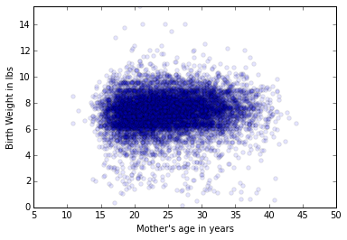
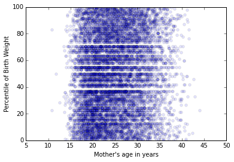
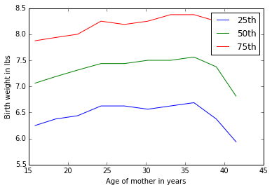

```python
%matplotlib inline

import numpy as np
import matplotlib.pyplot as plt
import pandas as pnd

import first
```


```python
live,firsts,others = first.MakeFrames()
live = live.dropna(subset=['agepreg','totalwgt_lb'])
ages = live['agepreg']
weights = live['totalwgt_lb']
```

The exercise first asks for the plot of birth weight versus mothers age.  In order to plot this, we drop missing values from age and weight so that we have two equal length data frames.  Then we plot them.  The plot doesn't show much significant information.


```python
plt.scatter(ages,weights,alpha =.1)
plt.ylabel('Birth Weight in lbs')
plt.xlabel('Mother\'s age in years')
plt.ylim(0,max(weights))
```


    (0, 15.4375)





```python
def percentile(values):
    d=[]
    s = sorted(values)
    total = len(values)
    for value in values:
        d.append((value,100.0*(s.index(value)+1.0)/total))
    return d
```

Next I plotted "Percentiles of birth weight versus mother's age."  It turns out the plot they were looking for was not literally this, but  here it is anyway.  There's no significant observation from this graph as well.


```python
plt.scatter(ages,[i[1] for i in percentile(weights)],alpha =.1)
plt.ylabel('Percentile of Birth Weight')
plt.xlabel('Mother\'s age in years')
plt.ylim(0,100)
```


    (0, 100)





```python
bins = np.arange(min(ages),max(ages),3)
indices = np.digitize(live['agepreg'],bins)
groups = live.groupby(indices)

group_ages = [group.agepreg.mean() for i,group in groups][1:-1]
group_weights = [group.totalwgt_lb for i, group in groups][1:-1]
```


```python
def perc_by_age(data,perc):
    l = []
    for i in data:
        a = np.asarray(percentile(i))
        idx = (np.abs(a[:,1]-perc)).argmin()
        l.append(a[idx][0])
    return l
```

Here's the correct plot of the birthweight percentiles versus bins of mothers ages.  It appears here that up to a certain point, around 35 mother's ages positively correlate to birth weight.  But after 35 there is a negative correlation.


```python
perc_by_age(group_weights,25)
fig, ax = plt.subplots()
ax.plot(group_ages,perc_by_age(group_weights,25),label='25th')
ax.plot(group_ages,perc_by_age(group_weights,50),label='50th')
ax.plot(group_ages,perc_by_age(group_weights,75),label='75th')
ax.legend()
ax.set_xlabel('Age of mother in years')
ax.set_ylabel('Birth weight in lbs')
```


    <matplotlib.text.Text at 0x7ff8ac1963d0>





```python
def pearsons(x,y):
    x = np.asarray(x)
    y = np.asarray(y)

    varx = np.var(x)
    vary = np.var(y)
    meanx = np.mean(x)
    meany = np.mean(y)

    cov = np.dot(x-meanx,y-meany)/len(x)
    return cov/((varx*vary)**(1./2))

print 'Pearson\'s correlation:',pearsons(ages,weights)
```

    Pearson's correlation: 0.0688339703541


```python
def spearmans(x,y):
    x = pnd.Series(x).rank()
    y = pnd.Series(y).rank()
    return pearsons(x,y)

print 'Spearman\'s correlation:', spearmans(ages,weights)
```

    Spearman's correlation: 0.0946100410966


Based on the pearson's and spearman's correlations the birthweight and age seem to be loosely positively linearly correlated.  Because Spearman's correlation is higher than Pearson's it suggests that the relationships between the two are related more in terms of rank than value.  <br>

While an increase in age generally equates to an increase in weight, that increase is not a constant porportion.<br>

Out of curiosity I separated the two groups into above 35 and under 35 and recalculated the correlations.  The results are pretty about what I expected. The correlation for before 35 improves, and the correlation for after 35 is negative.


```python
u35age = live[live['agepreg']<35]['agepreg']
u35weight = live[live['agepreg']<35]['totalwgt_lb']
print pearsons(u35age,u35weight)
print spearmans(u35age,u35weight)
```

    0.0792576952971
    0.0968711367622


```python
o35age = live[live['agepreg']>=35]['agepreg']
o35weight = live[live['agepreg']>=35]['totalwgt_lb']
print pearsons(o35age,o35weight)
print spearmans(o35age,o35weight)
```

    -0.0915806880283
    -0.0574059959786
