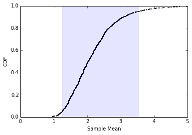
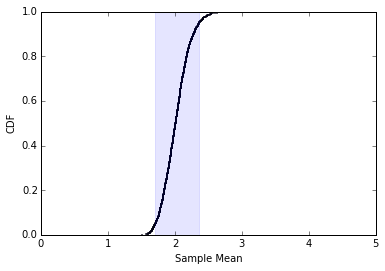
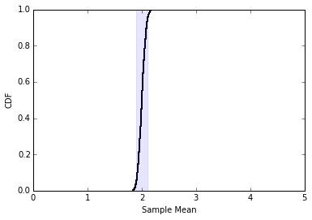
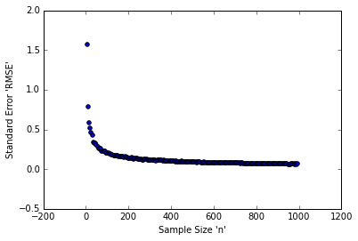

```python
%matplotlib inline

import math
import random
import numpy as np
import matplotlib.pyplot as plt

from matplotlib.patches import Rectangle
from estimation import RMSE, MeanError
```

We want to draw a sample size n=10 from an exponential distribution with lambda = 2.  We will repeat this experiment 1000 times and plot the sampling distribution for L as well as compute the standard error and 90% CI.<br>

In order to do this we need functions that do the following:
- Take the 1000 samples of size n.
- Calculate the SE of the distribution of sample means.
- Create a CDF for the distribution of sample means.
- Calculate the 5th and 95th percentile for the distribution of sample means.


```python
def exp_sample(n, m):
    lam = 2

    means = []
    for _ in range(m):
        xs = np.random.exponential(1.0/lam, n)
        L = 1/np.mean(xs)
        means.append(L)

    se = standard_error(means,lam)
    return means, se

def pmf(lst):    
    my_pmf = {}
    for i in lst:
        my_pmf[i] = float(lst.count(i))/len(lst)
    return my_pmf

def cdf(pmf):
    my_cdf = {}
    previous = 0
    for key in sorted(pmf):
        my_cdf[key] = pmf[key] + previous
        previous = my_cdf[key]
    return my_cdf

def standard_error(est, actual):
    squared = [(e-actual)**2 for e in est]
    return (np.mean(squared))**(.5)

def percentile(values):
    d=[]
    s = sorted(values)
    total = len(values)
    for value in values:
        d.append((value,100.0*(s.index(value)+1.0)/total))
    return d

def perc_to_value(data,perc):
    a = np.asarray(percentile(data))
    idx = (np.abs(a[:,1]-perc)).argmin()
    return a[idx][0]
```

Testing n = 10, 100, 1000


```python
def exercise(n):
    samples, se = exp_sample(n,1000)
    fifth = perc_to_value(samples,5)
    ninetyfifth = perc_to_value(samples,95)
    print 'Standard Error:',se
    print '5th percentile to 95th percentile:',fifth,'-',ninetyfifth
    my_cdf = cdf(pmf(samples))

    plt.scatter(my_cdf.keys(), my_cdf.values(),s=.5)
    plt.axis([0,5,0,1])
    plt.ylabel('CDF')
    plt.xlabel('Sample Mean')
    plt.gca().add_patch(Rectangle((fifth, 0),ninetyfifth-fifth,1,color='b',alpha=.1))
```


```python
exercise(10) #For n = 10
```

    Standard Error: 0.770824774407
    5th percentile to 95th percentile: 1.25328650812 - 3.53813871313





```python
exercise(100) #For n = 100
```

    Standard Error: 0.200942690481
    5th percentile to 95th percentile: 1.71021037626 - 2.36427441604





```python
exercise(1000) #For n = 1000
```

    Standard Error: 0.0637315570197
    5th percentile to 95th percentile: 1.90048172955 - 2.1081258094





```python
all_se = []
for n in range(5,1000,5):
    samples, se = exp_sample(n,1000)
    all_se.append(se)
plt.scatter(range(5,1000,5),all_se)
plt.ylabel('Standard Error \'RMSE\'')
plt.xlabel('Sample Size \'n\'')
```


    <matplotlib.text.Text at 0x7f7e19b70a90>





For all three values of n, the lambda of 2 was contained within the confidence interval.<br>

As shown by the 3 values of n, as n increases the confidence interval shrinks in size.<br>

The last chart of RMSE versus n shows that as n increases RMSE decreases towards 0.<br>
