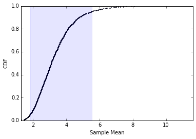
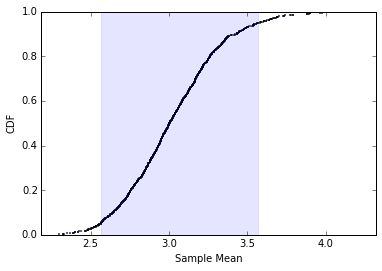
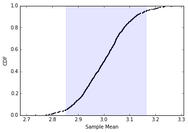
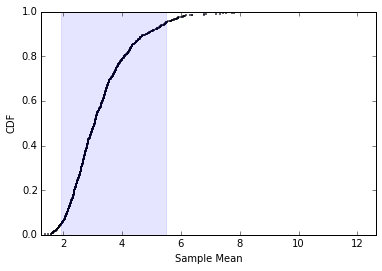
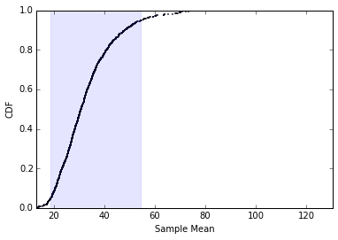
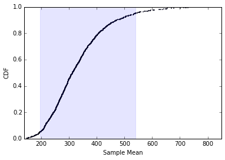

```python
%matplotlib inline

import matplotlib.pyplot as plt
import numpy as np
import random

from matplotlib.patches import Rectangle
```

For this exercise we'll be using some functions from the previous exercise to find cdf, RMSE, and CI.


```python
def pmf(lst):    
    my_pmf = {}
    for i in lst:
        my_pmf[i] = float(lst.count(i))/len(lst)
    return my_pmf

def cdf(pmf):
    my_cdf = {}
    previous = 0
    for key in sorted(pmf):
        my_cdf[key] = pmf[key] + previous
        previous = my_cdf[key]
    return my_cdf

def standard_error(est, actual):
    squared = [(e-actual)**2 for e in est]
    return (np.mean(squared))**(.5)

def mean_error(est,actual):
    errors = [e-actual for e in est]
    return np.mean(errors)

def percentile(values):
    d=[]
    s = sorted(values)
    total = len(values)
    for value in values:
        d.append((value,100.0*(s.index(value)+1.0)/total))
    return d

def perc_to_value(data,perc):
    a = np.asarray(percentile(data))
    idx = (np.abs(a[:,1]-perc)).argmin()
    return a[idx][0]
```

The function sim_game simulates a game where time between goals is exponential.  The time between goals is expected to be 1/3 of a game when 3 goals are expected.  So lam is 3 if we expect 3 goals/game.


```python
def sim_game(lam):
    goals = 0
    t = 0
    while t <= 1:
        #exponential random variable with 3 goals expected per game
        t+= random.expovariate(lam)
        if t<=1:
            #each time a random variable is chosen and time not elapsed add one goal
            goals+=1
    return goals
```

sim_sample takes lam - the number of goals expected in a game, n - the sample size, and m - the number of samples to take, and creates a CDF of those samples.<br>
It calculates the Mean Error, Standard Error, and 90% CI.


```python
def sim_sample(lam,n,m):
    estimates = []
    for j in range(m):
        values = np.random.exponential(1.0/lam,n)
        lam_estimate = 1.0/np.mean(values)
        estimates.append(lam_estimate)

    std_error = standard_error(estimates, lam)
    mean_err = mean_error(estimates,lam)
    print 'Mean Error:', mean_err
    print 'Standard Error:', std_error

    est_pmf = pmf(estimates)
    est_cdf = cdf(est_pmf)

    fifth = perc_to_value(est_cdf,5)
    ninety_fifth = perc_to_value(est_cdf,95)
    print '90% CI:',fifth,'-',ninety_fifth

    plt.scatter(est_cdf.keys(), est_cdf.values(),s=.5)
    plt.axis([min(est_cdf.keys()),max(est_cdf.keys()),0,1])
    plt.ylabel('CDF')
    plt.xlabel('Sample Mean')
    plt.gca().add_patch(Rectangle((fifth, 0),ninety_fifth-fifth,1,color='b',alpha=.1))

    return estimates, est_cdf
```


```python
est, est_cdf = sim_sample(3,10,1000)
```

    Mean Error: 0.328473402719
    Standard Error: 1.25117121922
    90% CI: 1.83397730397 - 5.54124678131





```python
est, est_cdf = sim_sample(3,100,1000)
```

    Mean Error: 0.0255766544858
    Standard Error: 0.310575643753
    90% CI: 2.56352449838 - 3.57000599605





```python
est, est_cdf = sim_sample(3,1000,1000)
```

    Mean Error: 0.00282686632167
    Standard Error: 0.094641686135
    90% CI: 2.85288222239 - 3.16329987017





Based on the above three graphs, we see that as n increases RMSE and SE decrease and the CI shrinks.<br>

Because RMSE appears to be approaching 0 as n increases so sampling error is decreasing. I would say this method for estimation is unbiased.


```python
est, est_cdf = sim_sample(3,10,1000)
```

    Mean Error: 0.303783335136
    Standard Error: 1.19952882299
    90% CI: 1.93661343551 - 5.48288118627





```python
est, est_cdf = sim_sample(30,10,1000)
```

    Mean Error: 3.04380029424
    Standard Error: 12.2799522862
    90% CI: 18.8969974861 - 54.5670641224





```python
est, est_cdf = sim_sample(300,10,1000)
```

    Mean Error: 32.5999641797
    Standard Error: 113.493232506
    90% CI: 194.409366226 - 538.445364805





It appears that as lambda increases, the mean error increases.  However, based on the three graphs above, the increase in error seems directly proportional to the increase in lambda.  The graphs are the same but scaled by multiples of 10.
